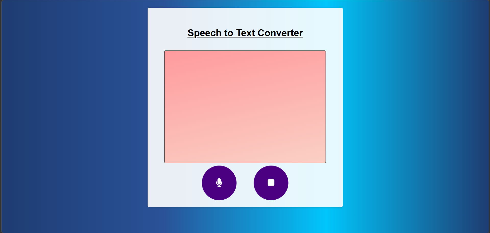
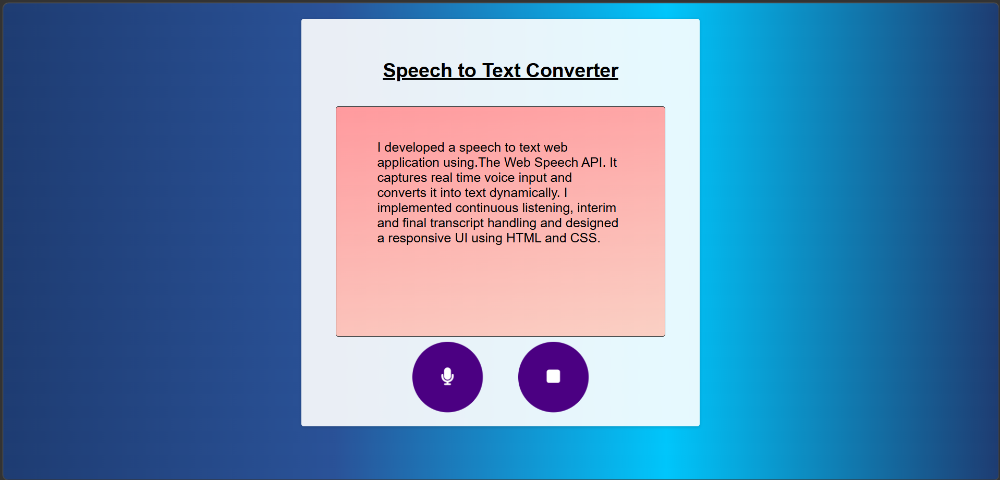

# 🎤 Speech to Text Converter

A modern and interactive web application that converts spoken words into text in real-time using the Web Speech API. This project demonstrates how voice recognition can be integrated into web applications for better user interaction.

---

## 🚀 Features

- 🎙️ Real-time speech recognition
- ⏯️ Start and stop voice recording
- 📝 Displays both interim and final transcripts
- 🎨 Clean and responsive user interface
- ⚡ Fast and lightweight (runs directly in browser)

---

## 🛠️ Technologies Used

- HTML5
- CSS3
- JavaScript (ES6)
- Web Speech API (`webkitSpeechRecognition`)

---

## 📸 Project Screenshots

### 🖥️ User Interface

### 🎤 Working Demo

---

## ▶️ How to Use

1. Open the application in **Google Chrome**
2. Click on the **microphone button 🎤**
3. Start speaking
4. Click the **stop button ⏹️**
5. View the converted text instantly

---

## ⚠️ Note

- Works best in **Google Chrome**
- Requires microphone permission

---

## 📌 Future Enhancements

- 🌐 Multi-language support
- 💾 Download transcript feature
- 📂 Upload audio file and convert to text
- 🌙 Dark mode

---

## 🌍 Live Demo

(https://github.com/Ravitheja-hub/speech-to-text)

---

## 👨‍💻 Author

**Ravitheja Y G**

---

## ⭐ Support

If you like this project, give it a ⭐ on GitHub!
